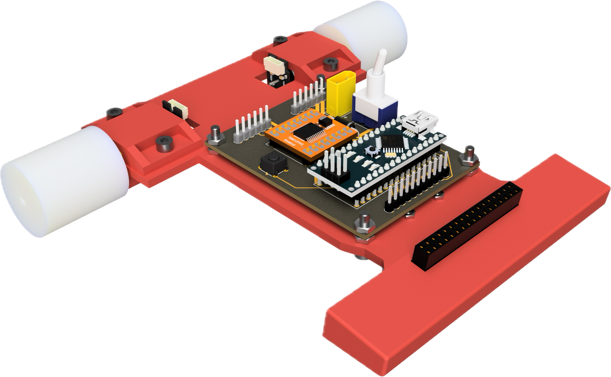

# Line Follower Robot

# Table of contents

- [Overview](#overview)
- [Installation and Setup](#installation-and-setup)
    - [1. Clone the repository](#1-clone-the-repository)
- [UML Class Diagram](#uml-class-diagram)
- [Participants](#participants)

## Overview
This is a school project for a line follower robot.

### Components
- QTR 25 Sensor Array
- Motor Driver
- 



## Installation and Setup

### 1. **Clone the repository:**
   ``` 
    git clone git@github.com:HermanGran/LineFollowerRobot.git
   ```

## UML Class Diagram


## Participants
- Herman Gran
- Tore Espenakk